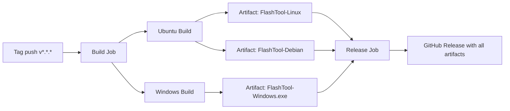

# FlashTool — Deployment Guide

## Build Requirements

| Platform | Requirements |
|----------|------------|
| Linux (Ubuntu) | Python 3.10+, `python3-tk`, `tk-dev`, `dpkg-deb`, `adb`, `fastboot` |
| Windows | Python 3.10+, `adb` / `fastboot` on PATH, optional Inno Setup for installer |
| Both | `pip`, `venv` support, `pyinstaller` |

## Local Development Run

### Linux

```bash
chmod +x scripts/run_linux.sh
./scripts/run_linux.sh
```

### Windows

```cmd
scripts\run_windows.bat
```

### Manual

```bash
pip install -r requirements.txt
python main.py
```

## PyInstaller Build

### Spec File (`FlashTool.spec`)

The spec file defines:

| Setting | Value |
|---------|-------|
| Entry script | `main.py` |
| Bundled data | `assets/icon.png`, existing `assets/{e9,e10,e11,ps10,ps11}`, all flash scripts |
| Hidden imports | All `flash_tool` submodules + `customtkinter` |
| Console | `False` (GUI app, no terminal window) |
| Icon | `assets/icon.png` |

Jenkins flashing requires an exact, OS-matched profile asset. For PS11 Jenkins,
the default flow preserves the root `vbmeta`, `boot`, and `vendor_boot` from the
existing Official base; it must not substitute a generic bundled vbmeta image.
The `--disable-avb` override is accepted only when the selected Jenkins ROM
contains its own valid `vbmeta_verification_disabled.img`. E9/E10 must receive
their own verified image and never inherit one from another profile. For PS11
Jenkins, `init_boot.img` and `pvmfw.img` are boot-critical and are flashed
before fastbootd. Flashing stops if the OS version cannot be read, the current
base cannot be verified over ADB, or another core Jenkins image is missing.
No PS11 disabled-root asset is bundled until one is verified for the target OS;
the explicit override fails closed when the ROM-local asset is absent or its
fingerprint does not match the selected Android major version.
The PS11 wait loop treats `fastboot devices` as enumeration only; dynamic
partition flashing starts only after `fastboot getvar is-userspace` reports
`yes`. A USB timeout while requesting `reboot fastboot` is treated as a mode
transition only when the subsequent fastbootd check succeeds.
Before a Jenkins flash, the tool reads the current Android fingerprint over ADB
and requires the same PS11 family and Android major version. A build ID
difference such as Jenkins A8110 on an Official A8070 base is allowed and
reported as a warning because the existing Official boot/vendor_boot/root
vbmeta remain in place. After reboot, it waits for ADB and verifies the booted
fingerprint; returning to the bootloader is reported as a failed flash instead
of a successful completion.

### Build Command

```bash
pyinstaller FlashTool.spec --clean --noconfirm
```

Output:
- Linux: `dist/FlashTool`
- Windows: `dist/FlashTool.exe`

## Linux Packaging

### Standalone Binary

`scripts/build_linux.sh` automates the full flow:

1. Creates/activates `.venv`
2. Installs dependencies + PyInstaller
3. Builds `dist/FlashTool`
4. Builds `.deb` package with:
   - Binary → `/usr/bin/flashtool`
   - `.desktop` entry → `/usr/share/applications/`
   - Icon → `/usr/share/pixmaps/`
   - `postinst` script for icon cache update
   - `Depends: android-tools-adb, android-tools-fastboot`

```bash
chmod +x scripts/build_linux.sh
./scripts/build_linux.sh
```

Artifacts:
- `dist/FlashTool`
- `dist/flashtool_${VERSION}_${ARCH}.deb`

Install the `.deb`:

```bash
sudo dpkg -i dist/flashtool_1.1.7_amd64.deb
```

## Windows Packaging

### Standalone EXE

`scripts/build_windows.bat` automates:

1. Creates/activates `.venv`
2. Installs dependencies + PyInstaller
3. Builds `dist/FlashTool.exe`
4. Generates `dist/FlashTool_InnoSetup.iss` for Inno Setup

```cmd
scripts\build_windows.bat
```

### Installer (Inno Setup)

1. Install [Inno Setup](https://jrsoftware.org/isinfo.php)
2. Open `dist/FlashTool_InnoSetup.iss`
3. Click **Compile**
4. Output: `dist/installer/FlashTool_Setup_*.exe`

## CI/CD Pipeline

### GitHub Actions (`.github/workflows/release.yml`)

| Trigger | Event |
|---------|-------|
| Automatic | Push of version tag matching `v*.*.*` |
| Manual | `workflow_dispatch` from Actions tab |

### Jobs



### Build Job Matrix

| OS | Artifact Name | Output Path |
|----|-------------|-------------|
| `ubuntu-latest` | `FlashTool-Linux` | `dist/FlashTool-Linux` |
| `ubuntu-latest` | `FlashTool-Debian` | `dist/*.deb` |
| `windows-latest` | `FlashTool-Windows` | `dist/FlashTool-Windows.exe` |

### Release Job

- Runs only on tag pushes (`refs/tags/v*`)
- Downloads all artifacts
- Creates GitHub Release via `softprops/action-gh-release@v2`
- Attaches:
  - `dist/FlashTool-Linux`
  - `dist/FlashTool-Windows.exe`
  - `dist/*.deb`

### Triggering a Release

```bash
git tag v1.2.0
git push origin v1.2.0
```

### Debian Package Details (CI)

The CI `.deb` build mirrors `scripts/build_linux.sh` with these fields:

| Field | Value |
|-------|-------|
| Package | `flashtool` |
| Version | Derived from tag (`v1.2.0` → `1.2.0`) |
| Architecture | `amd64` |
| Depends | `android-tools-adb`, `android-tools-fastboot` |
| Section | `utils` |

## Release Checklist

- [x] Version bumped in `flash_tool/config.py` (`APP_VERSION`)
- [x] Version bumped in `scripts/build_linux.sh` (`APP_VERSION`)
- [x] Version bumped in `scripts/build_windows.bat` (`AppVersion`)
- [ ] `FlashTool.spec` hiddenimports cover any new modules
- [ ] New device scripts added to `FlashTool.spec` `datas` list if applicable
- [ ] README.md updated with new device or feature notes
- [ ] Tag follows `v*.*.*` format
- [ ] CI build passes on both Ubuntu and Windows
- [ ] GitHub Release contains Linux binary, Windows `.exe`, and `.deb`
