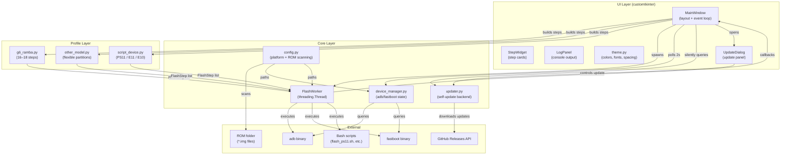

# FlashTool — System Architecture

## High-Level Architecture



## Data Flow

### 1. ROM Selection Flow

```
User selects folder
    │
    ▼
config.scan_rom_folder(path)  ──►  dict[str, list[str]]
    │                                (partition → matched files)
    ▼
MainWindow populates image dropdowns
    │
    ▼
User selects or confirms each image
    │
    ▼
MainWindow.selected_images  ──►  dict[str, str]
```

### 2. Flash Execution Flow

```
User clicks "Flash"
    │
    ▼
MainWindow builds steps via profile builder
    │
    ▼
FlashWorker(steps, rom_path, selected_images,
            on_progress, on_log, on_finished)
    │
    ▼
Background Thread ──►  per step:
                         • wait_for_device (if needed)
                         • _build_command (resolve image paths)
                         • subprocess.Popen (stream stdout)
                         • parse sparse progress / script phases
                         • emit FlashProgress → UI
    │
    ▼
MainWindow updates StepWidget + LogPanel via callbacks
```

### 3. Device Polling Flow

```
MainWindow._poll_device() ──►  after(2000ms)
    │
    ▼
device_manager.get_device_state()
    │
    ▼
(fastboot devices) ──► (adb devices) ──► disconnected
    │
    ▼
Update header dot color + label
```

## Component Interactions

| Component | Responsibility | Collaborators |
|-----------|----------------|---------------|
| `MainWindow` | Layout, event wiring, state aggregation, profile switching | `StepWidget`, `LogPanel`, `FlashWorker`, `config`, `device_manager` |
| `FlashWorker` | Sequential step execution in a background thread | `device_manager`, `config` (paths), profiles (step list) |
| `StepWidget` | Visual representation of one `FlashStep` | `theme.py` only |
| `device_manager` | Pure functions for adb/fastboot queries | `config` (binary paths) |
| `config` | Platform utilities and ROM scanning | None (static functions) |
| Profiles | Step list generators | `FlashStep` dataclass |

## State Management

### UI State (MainWindow attributes)

| Attribute | Type | Description |
|-----------|------|-------------|
| `current_model` | `StringVar` | Selected device model |
| `rom_path` | `str` | Absolute path to ROM folder |
| `detected_images` | `dict[str, list[str]]` | All matches from `scan_rom_folder` |
| `selected_images` | `dict[str, str]` | Final chosen file per partition |
| `skip_suw_var` | `BooleanVar` | Append SUW-bypass steps |
| `flash_steps` | `list[FlashStep]` | Current profile step list |
| `worker` | `FlashWorker \| None` | Active background thread |
| `step_widgets` | `dict[int, StepWidget]` | ID → widget mapping |

### Worker State (FlashStep attributes)

| Attribute | Type | Description |
|-----------|------|-------------|
| `status` | `StepStatus` | `PENDING`, `WAITING`, `RUNNING`, `SUCCESS`, `FAILED`, `SKIPPED` |
| `progress` | `float` | 0.0–1.0; parsed from sparse-image output |
| `elapsed` | `float` | Seconds since step started |
| `output` | `str` | Accumulated stdout/stderr |

### Thread Safety

- `FlashWorker` runs in a daemon thread.
- All UI updates from the worker are **callbacks dispatched onto the main thread** via customtkinter's implicit thread safety (tkinter is not thread-safe; in this codebase callbacks are invoked directly and the app relies on the GIL + quick callback returns; for heavy UI updates `after()` should be considered).
- `FlashWorker.stop()` sets a `threading.Event`; the worker checks `self.stopped` between steps and during stdout streaming.

## Key Data Structures

### FlashStep

```python
@dataclass
class FlashStep:
    id: int
    name: str
    command: str                 # "adb" | "fastboot" | "script" | "script_phase"
    args: list[str]
    timeout: int = 300
    wait_for_device_mode: str = ""   # "fastboot" | "adb" | ""
    wait_timeout: int = 120
    user_action: str = ""            # Instruction for manual confirmation
    image_key: str = ""              # Partition key for auto-resolve
    image_arg_index: int = -1        # Which arg to replace with image path
    script_phase_pattern: str = ""   # Regex to match script stdout phase
    status: StepStatus = StepStatus.PENDING
    progress: float = 0.0
    elapsed: float = 0.0
    output: str = ""
```

### FlashProgress

```python
@dataclass
class FlashProgress:
    step_id: int
    status: StepStatus
    progress: float
    elapsed: float
    message: str
    output_line: str = ""
```
